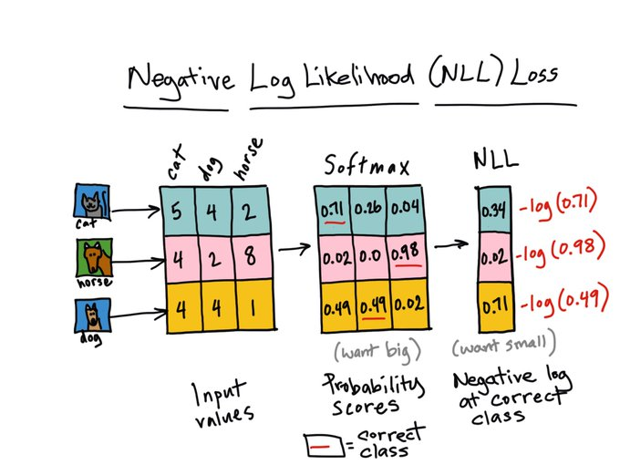

# SUM(MNIST, Random Number) Detector

### [Click to Try it out on Google Colab](https://colab.research.google.com/drive/1wy1GrFeDH6lZaXXtrv9StP6VumBqSeNp?usp=sharing)

## Objective
A Neural Netwrok which 
* Take two inputs:
    * an image from MNIST dataset, and
    * a random number between 0 and 9
* Gives two outputs:
    * the "number" that was represented by the MNIST image, and
    * the "sum" of this number with the random number that was generated and sent as the input to the network


## Data Representation
A Custom class `MNISTRandomNumber` is created which take two Inputs.
The MNIST Data either Train or Test Data and the Trasnformation to be performed on these images.

The class have a \_\_getitem\_\_() method, which will index the MNIST data and also created a Random Number
between 0 and 9.

The Random Number is than converted to a one hot encoded vector whcih also side MNIST image is sent as a tuple of
input from the class.  
On the other hand the MNIST label and the **sum** of MNIST label the random number genrated is added and the result along
with MNIST label is send as a tuple of labels.

### Intuition behind the Data
The Data is for MNIST is trasnformed to Tensor and Normalized with Mean of 0.1307 and with Stadnard Deviation of 0.3081.
Where as the Radnom Number generated is converted to a vector to make it a classifcation problem, where the netwrok can predict the correct class.  
Here the class for Random Number is just the index of the vector. So while creating the vector, a all Zero 1x10 vector is created, and the
random number index of the vector is raplced by 1.
```
Ex: random_num = 3
vector = [0, 0, 0, 1, 0, 0, 0, 0, 0, 0] 
```

This is done so that, it becomes a classifcation problem rather than a regression problem, and a suitable loss such as Negative Log-Liklehood along with Softmax can be used, which is discussed further below.

## Model
The Nerural Net model developed involves both 2D Convolution and Fully Connected Layers, this was done to make sure that the Convoltions part classifies the MNIST Image and produce a final one hot encoded vector after softmax, and that prediction is send as first half of output, and also the same vector is also concated with the Random Number
to create a 1x20 vector which is than passed to a Fully connected layer and finaly a 1x19 vector which is the prediction of sum of MNIST and Random Number (sum varies between 0 to 18) is sent as second half of output.

### Architecture


The convolution part of the Netwrok, has 7 convolutions layers and 2 max pool layers after every 2 conv layers in the beginning and followed by 3 Conv layers, bringing the size of image from 28x28 to 1x1. It's not a good practice to bring down the image size to 1x1, but since we are concating it with a 1x10 vector and it's a small image, it should work just fine.

Than There are 3 Fully Connected (Linear) layers, which take the 1x20 vector and passes through a hidden layer with 50x100 weights and gives a final output of 1x19 vector.

## Training
The model is trained using batches of 256 Images, and after every batch the loss is calculated and the loss is backprogated to fine tune the model parameters, and the process is repeated for all the batches which is 1 epoch. The whole model training is done for 15 epochs.

### Loss Function
The Negative Log Likelihood loss function is used, which is very suitable for multi label classification, which in our case is 10 classes and 19 classes classifcaiton. So we are using 2 loss function both of which are NLL-loss.

The output of convolutions and linear layers are sent to Softmax to bring the class predictions between 0-1 and than those outputs are used in NLL-loss and compared with the target labels.  
Note: This both steps can be converted to one step by directly outputing the convultion/linear layer outputs to Cross Entropy Loss which is internally combination of same softmax and NLL. 

    Why Log likelihood and why negative?

    The log function goes from very small values for small input to very very large towards infinite as the input value increases. The negative of that is the value is infinite when input is zero, and reduces to very very low values (towards zero) when the input increases.

    Since, our log_softmax give higher and higher values to the correct prediction, and very low values if the prediction is off by very much.

    We know that loss function is happy when value is low and unhappy when value is high.  
    The NLL becomes unhappy when there is wrong predictions and give a high value, where as when the prediction is correct it becomes happy and give a low value.

The below picture, depicts well why Softmax and NLL is being used:



Source: https://twitter.com/rheartpython/status/1040963091670986752

### Evaluation
The basic Accuracy evaluation was performed.

Where we count the correct MNIST Images Predicted and also the correct sum of MNIST and Random Number predicted is calculated separatly, is divided by total number of images present.

For more precise, accuracy, confusion matrix could have been used to udnerstand which class was having lower accuracy, and to know False Postives and False Negatives, but the accuracy metric was good enough keeping in mind the **dataset is balanced** with same number of Images and Numbers of each class

#### Training Log
epoch: 1  
loss=2.5238044261932373 batch_id=233: 100%|██████████| 234/234 [00:10<00:00, 22.54it/s]  
Test set: Average loss: 2.4852, Accuracy1: 9537/10000 (95%), Accuracy2: 1499/10000 (15%)

epoch: 2  
loss=1.719759464263916 batch_id=233: 100%|██████████| 234/234 [00:10<00:00, 22.52it/s]  
Test set: Average loss: 1.6819, Accuracy1: 9811/10000 (98%), Accuracy2: 3537/10000 (35%)  
.  
.  
.  
.  
.  
epoch: 13  
loss=0.5588935017585754 batch_id=233: 100%|██████████| 234/234 [00:10<00:00, 23.11it/s]  
Test set: Average loss: 0.5561, Accuracy1: 9920/10000 (99%), Accuracy2: 8934/10000 (89%)

epoch: 14  
loss=0.5759037137031555 batch_id=233: 100%|██████████| 234/234 [00:10<00:00, 23.25it/s]  
Test set: Average loss: 0.6275, Accuracy1: 9930/10000 (99%), Accuracy2: 8540/10000 (85%)

epoch: 15  
loss=0.3486509323120117 batch_id=233: 100%|██████████| 234/234 [00:10<00:00, 23.09it/s]  
Test set: Average loss: 0.4751, Accuracy1: 9924/10000 (99%), Accuracy2: 9248/10000 (92%)

## Results

### MNIST Accuracy -> **99.24%**

### MNIST + Random Number SUM Accuracy -> **92.5%**


### *Personal Thanks to Google Colab for providing such a wonderful service for training models on GPU for FREE!*